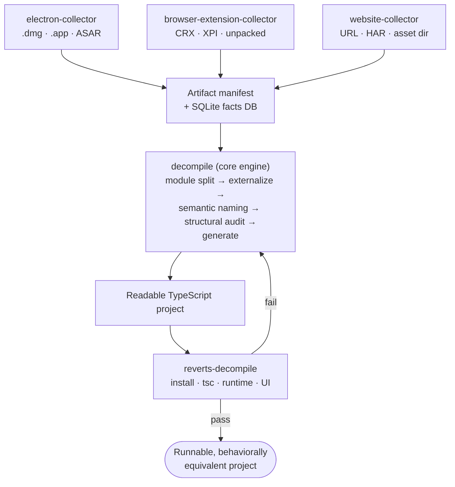

# ReverTS Skills

This directory is the canonical source of all ReverTS Claude/Codex skills.
Each subdirectory ships as one skill bundle. Skills are **installed** into the
host's skill loader (`~/.claude/skills/`, `~/.codex/skills/`, or a plugin cache);
they are not loaded directly from this repository at runtime.

## Layout

```
skills/
├── decompile/                # webpack/esbuild bundle decompilation pipeline
├── browser-extension-collector/ # browser-extension artifact collection + manifest ingestion
├── electron-collector/       # Electron artifact collection + decompile handoff
├── website-collector/        # website frontend (URL/HAR/dir) capture + web-app decompile handoff
├── reverts-decompile/        # post-export install / tsc / startup validation
└── install                   # local-dev installer script (symlinks into ~/.claude/skills)
```

Each skill directory contains:

- `SKILL.md` — required, with YAML frontmatter (`name`, `description`).
- `references/` — supporting documents loaded on demand by the skill body.
- `bin/` — optional collector/utility scripts the skill invokes.
- `agents/` — optional sub-agent prompt templates.

## How the skills fit together

The skills fall into three roles. **Collectors** turn one input family into a
ReverTS artifact manifest and ingest it into a SQLite facts database; the single
**core engine** decompiles those facts into a readable TypeScript project; the
**validator** proves the result installs, compiles, and runs — looping failures
back to the engine.

| Role | Skill | Handles | Produces |
|------|-------|---------|----------|
| **Collect** | `electron-collector` | `.dmg`, `.app`, `Resources/`, ASAR | manifest + facts DB |
| **Collect** | `browser-extension-collector` | CRX, XPI, unpacked, installed | manifest + facts DB |
| **Collect** | `website-collector` | live URL, HAR, asset directory | manifest + facts DB |
| **Decompile** | `decompile` | facts DB | readable TypeScript project |
| **Validate** | `reverts-decompile` | generated project | install / `tsc` / runtime / UI verdict |

Pick exactly one collector for your input; everything downstream is shared:



This is the **universal ReverTS pipeline** — it is the same for every input. The
only thing that varies is which collector you enter through; the engine and the
validator are shared. The Claude desktop app, for instance, is simply one
`electron-collector` input; a Chrome extension enters through
`browser-extension-collector` and an SPA through `website-collector`, then both
follow the exact same `decompile → reverts-decompile` path.

Each step is a `reverts-cli` invocation — the skills sequence and gate them; see
each `SKILL.md` for the exact commands and completion criteria.

## Install

A working setup is **two pieces** and they install **together**: the
`reverts-cli` **binary** (the engine the skills shell out to) and the **skill
bundle** (the agent playbook). The skills are not MCP tools — there is no server.

### Recommended: one command (downloads the prebuilt release)

This downloads the platform binary **and** installs the skills — no Rust
toolchain, no build from source:

```bash
curl -fsSL https://raw.githubusercontent.com/chaizhenhua/reverts/main/install.sh | sh
```

It fetches the release tarball for your platform (Linux/macOS · x86_64/aarch64),
verifies its checksum, installs the binary into `~/.reverts/bin`, and installs
the skills into `~/.claude/skills` (and `~/.codex/skills` when present). Pin a
version or change paths via env vars — see the [top-level
README](../README.md#install-options) (`REVERTS_VERSION`, `REVERTS_HOME`,
`REVERTS_SKILLS_DIR`, `REVERTS_NO_SKILLS`, `REVERTS_BASE_URL`).

**Restart your Claude/Codex session** after installing so the registry rebinds.
The skills then appear under the `reverts:` namespace
(`reverts:electron-collector`, `reverts:decompile`, …).

### Auto-bootstrap: the binary installs itself on first use

You do **not** have to install the binary separately ahead of time. Each
collector skill runs a preflight — [`bin/ensure-reverts-cli`](bin/ensure-reverts-cli) —
that checks for `reverts-cli` and, if it is missing, **downloads the release
binary** before the first command. So the minimum is: install the skill bundle,
ask the agent to decompile something, and the binary is fetched on demand.

### For skill development (this worktree)

Working *on* the skills? Build the binary locally and symlink the skill dirs so
edits show up live:

```bash
cargo build --release --bin reverts-cli          # local engine
ln -sf "$(pwd)/target/release/reverts-cli" ~/.local/bin/reverts-cli
./skills/install                                  # symlink skills → ~/.claude/skills
./skills/install --target ~/.codex/skills         # ... and/or Codex
./skills/install --uninstall                       # remove the symlinks
```

## Usage

Drive the pipeline two ways: inside a Claude/Codex session you describe the
input and the matching collector skill sequences the steps; or you run the
`reverts-cli` commands directly (the skills wrap exactly these).

### From a session (recommended) — trigger prompts

After install, **start Claude Code (or Codex) and just ask**, naming the
artifact path and the goal. The matching skill loads automatically and runs the
full `collect → import → decompile → validate` loop (fetching `reverts-cli` on
first use if needed):

```
# Electron app  → reverts:electron-collector
> Decompile the Electron app at /Applications/Claude.app into a readable,
  runnable TypeScript project, then verify it compiles with tsc.

# Browser extension  → reverts:browser-extension-collector
> Decompile the Chrome extension at ~/Downloads/ublock.crx into readable
  TypeScript and validate the build.

# Website / SPA  → reverts:website-collector
> Capture and decompile the SPA at https://app.example.com into readable
  TypeScript — recover the module structure and externalize npm packages.
```

Prompt tips that make the skill trigger reliably and finish well:

- **Name the input explicitly** — an absolute path (`/Applications/Foo.app`), a
  file (`~/Downloads/ext.crx`), or a URL. Vague asks ("decompile my app") stall.
- **State the end goal** — "readable, runnable TypeScript" / "validate it
  compiles" — so the agent runs through generation *and* validation, not just
  ingestion.
- **Say "decompile"** (not "deobfuscate"/"unminify") — it maps to the skill set.
- You can force a path: *"use the reverts:electron-collector skill to …"*.

### Directly with reverts-cli (Electron example)

```bash
# 0. Collect the artifact manifest (collector script — Electron shown here)
python3 ~/.claude/skills/electron-collector/bin/collect_electron_artifact \
  /Applications/Claude.app \
  --output-manifest /tmp/claude/manifest.json \
  --stage-dir /tmp/claude/stage --json-report

# 1. Import the unpacked source + manifest into a SQLite facts DB (creates project 1)
reverts-cli import-unpacked \
  --input /tmp/claude/stage \
  --manifest /tmp/claude/manifest.json \
  --project-name claude-desktop \
  --output-db /tmp/claude/claude.sqlite

# 2. Generate the readable TypeScript project (modern src/ layout)
reverts-cli generate \
  --input /tmp/claude/claude.sqlite --project-id 1 \
  --output /tmp/claude/claude-src --source-root src

# 3. Externalize inlined npm packages back into bare imports
reverts-cli match-packages \
  --input /tmp/claude/claude.sqlite --project-id 1 \
  --materialize-package-sources --apply

# 4. Report coverage + naming progress (truthful numbers, JSON for CI)
reverts-cli full-inventory  --input /tmp/claude/claude.sqlite --project-id 1 --json /tmp/claude/inventory.json
reverts-cli naming-progress --input /tmp/claude/claude.sqlite --project-id 1
reverts-cli coverage-ledger --input /tmp/claude/claude.sqlite --project-id 1

# 5. Validate the generated project (install + tsc + runtime), via the
#    reverts-decompile skill's Electron profile
cd /tmp/claude/claude-src && npm install && npx tsc --noEmit
```

Browser-extension and website inputs follow the same shape — only step 0 (the
collector) differs (`browser-extension-collector` / `website-collector`); steps
1–5 are identical. Run `reverts-cli help <command>` for the full flag list of any
step.

## Authoring conventions

These conventions apply to every skill in this directory.

### Frontmatter

```yaml
---
name: <slug-matching-directory-name>
description: <one-line, action-oriented; used by the skill loader for routing>
---
```

`name` MUST match the directory name. `description` should encode the trigger
condition (when to invoke) — the loader presents this to the model when
deciding whether to call the skill.

### Required sections

Every `SKILL.md` should provide, in this order:

1. **Brief intro** — one paragraph stating what the skill does and when to use it.
2. **Agent boundary** — explicit "do not do X / only do Y" statements.
3. **Phases / workflow** — numbered or named stages with entry/exit conditions.
4. **Decision table** — when there are multiple input shapes or branches, list
   them in a table mapping condition → action.
5. **Completion criteria** — quantitative gate (counters, ratios, exit codes).
6. **Failure recovery** — what to do when a hard blocker is hit.
7. **Tool summary** — the `reverts-cli` commands the skill calls.
8. **References** — links to `references/*.md` for templates and deep dives.

### Style rules

- Prefer **quantitative gates** (`public_surface == 100%`, `tsc exit code 0`)
  over vague success criteria ("verify output looks right").
- Prefer **observable signals** for reverse anti-patterns (mention specific DB
  fields, log lines, file states), not psychological "red flags".
- Do not adopt coercive language ("you MUST", "1% chance"). State the cost of
  skipping a step instead.
- Define hard blockers explicitly: missing input, permission denied,
  `reverts-cli` not found on `PATH`, same operation failing N×, schema version
  mismatch.
- Keep `SKILL.md` under ~350 lines. Push templates, profile-specific checklists,
  and worked examples into `references/`.
- Keep `agents/openai.yaml` present for every committed skill, with UI metadata
  synchronized to the current `SKILL.md`.

### Cross-referencing

Within a SKILL body, link references with a relative path. For example,
`skills/decompile/SKILL.md` links to its sub-agent template like this:

```markdown
See [sub-agent-templates.md](references/sub-agent-templates.md).
```

(The same file is reachable from this README at
[decompile/references/sub-agent-templates.md](decompile/references/sub-agent-templates.md).)

Do not assume a particular install path — references are resolved relative to
the skill directory after install.

## Verifying changes

Before committing skill changes:

```bash
# 1. YAML frontmatter parses (every SKILL.md must start with --- ... ---)
for f in skills/*/SKILL.md; do
  python3 -c "import sys, yaml; yaml.safe_load(open('$f').read().split('---')[1])" || echo "FAIL $f"
done

# 2. Internal references resolve (strip anchors; ignore fenced code blocks)
python3 - <<'PY'
import re, pathlib, sys
broken = 0
for p in pathlib.Path('skills').rglob('*.md'):
    body = re.sub(r'```.*?```', '', p.read_text(), flags=re.DOTALL)
    for ref in re.findall(r'\]\(([^)]+)\)', body):
        if ref.startswith(('http', '#', 'mailto:')): continue
        path = ref.split('#', 1)[0]                # strip #anchor
        if not path: continue
        target = (p.parent / path).resolve()
        if not target.exists():
            print(f'MISSING {p}: {ref}'); broken += 1
sys.exit(0 if broken == 0 else 1)
PY

# 3. The CLI the skills shell out to still builds
cargo build --release --bin reverts-cli
```

## File layout invariants

- `skills/` is the single source of truth. Do not put committed skill content
  under `.claude/skills/` — that path is reserved for installer artifacts.
- Each subdirectory's name MUST equal its frontmatter `name`.
- `references/` is the only allowed home for supporting `.md` files.
- `agents/openai.yaml` should contain only product-facing metadata and optional
  tool dependencies; do not duplicate workflow instructions there.
